# 🐣 Hatch

*Zero‑copy analytics, delivered at Mach Arrow.*

[](https://goreportcard.com/report/github.com/TFMV/hatch)
[](LICENSE)
[](https://github.com/TFMV/hatch/actions/workflows/ci.yml)

## 🧠 The Big Idea

A great engine shouldn't be gated by heavyweight infra.
Hatch keeps DuckDB's magic small, open, and composable so your data can fly wherever you need it.

---

> Note: Hatch is in early development—functional but evolving rapidly. Expect changes and occasional breakage. Contributions, ideas, and experiments are welcome.
> For a production-ready implementation, see GizmoSQL (C++).

## 🙋 Why Hatch Exists

### 1. Arrow‑Native Networking Is Inevitable  

Flight SQL moves columnar data faster than REST or JDBC, with schemas baked in. DuckDB already "speaks Arrow" internally. Hatch lets it **broadcast**.

### 2. Self‑Hosted ≠ Heavyweight  

Options today: embed DuckDB yourself, bolt it onto Python/Java web servers, or go proprietary.  
Hatch offers a **third way**: a small server that does one thing: serve SQL over Flight.

### 3. Pipelines Need Lightweight Nodes  

Modern data stacks are Lego bricks: Redis for cache, NATS for events, DuckDB for OLAP. Hatch slots into that ecosystem—just stream Arrow in, stream Arrow out.

### 4. A Playground for Arrow Minds  

Want column‑level ACLs? Write a middleware.  
Need OpenTelemetry spans? Drop in an interceptor.  
Curious about WASM UDFs? Fork and go wild.  
Hatch is scaffolding, not a silo.

---

## 🚀 Quick Start

### From Source

```bash
go install github.com/TFMV/hatch/cmd/server@latest
hatch serve --config ./config.yaml
```

### Sample Query

```go
client, _ := flightsql.NewClient("localhost:32010")
ctx := context.Background()

// Standard SQL
rdr, _ := client.DoGet(ctx, "SELECT 42 AS answer")
for rdr.Next() { fmt.Println(rdr.Record()) }
```

---

## 🛡️ JDBC Connectivity and Authentication

Hatch supports JDBC connectivity through Arrow Flight SQL JDBC driver. You can connect to Hatch using the following JDBC URL format:

```bash
jdbc:arrow-flight-sql://localhost:32010
```

#### Authentication

Hatch supports multiple authentication methods that can be configured in your `config.yaml`:

1. **Basic Authentication**:

```yaml
auth:
  enabled: true
  type: basic
  basic_auth:
    users:
      admin:
        password: "your-secure-password"
        roles: ["admin"]
```

JDBC URL: `jdbc:arrow-flight-sql://localhost:32010?username=admin&password=your-secure-password`

2. **Bearer Token**:

```yaml
auth:
  enabled: true
  type: bearer
  bearer_auth:
    tokens:
      "your-secure-token": "admin"
```

JDBC URL: `jdbc:arrow-flight-sql://localhost:32010?token=your-secure-token`

3. **JWT Authentication**:

```yaml
auth:
  enabled: true
  type: jwt
  jwt_auth:
    secret: "your-jwt-secret"
    issuer: "hatch"
    audience: "flight-sql-clients"
```

JDBC URL: `jdbc:arrow-flight-sql://localhost:32010?token=your-jwt-token`

4. **OAuth2**:

```yaml
auth:
  enabled: true
  type: oauth2
  oauth2_auth:
    client_id: "your-client-id"
    client_secret: "your-client-secret"
    authorize_endpoint: "http://localhost:8080/oauth2/authorize"
    token_endpoint: "http://localhost:8080/oauth2/token"
    redirect_url: "http://localhost:8080"
```

JDBC URL: `jdbc:arrow-flight-sql://localhost:32010?useOAuth2=true&clientId=your-client-id&clientSecret=your-client-secret`

For secure production deployments, it's recommended to:

- Use TLS by configuring the `tls` section in your config
- Use strong passwords and tokens
- Regularly rotate credentials
- Implement proper role-based access control

---

## 🛠️ Configuration

Create a file `config.yaml` (all fields optional):

```yaml
server:
  address: "0.0.0.0:32010"
  max_connections: 10

database:
  dsn: "duckdb://:memory:"
  max_open_conns: 32
  health_check_period: "30s"

logging:
  level: "info"
  format: "json"

metrics:
  enabled: true
  endpoint: ":9090"

tracing:
  enabled: false

auth:
  enabled: true
  type: oauth2
  oauth2_auth:
    client_id: "your-client-id"
    client_secret: "your-client-secret"
    redirect_url: "localhost:8080" # OAuth2 HTTP server address
    authorize_endpoint: "/oauth2/authorize"
    token_endpoint: "/oauth2/token"
    scopes: ["read", "write"]
    access_token_ttl: 1h
    refresh_token_ttl: 24h
    allowed_grant_types:
      ["authorization_code", "refresh_token", "client_credentials"]
```

Then:

```bash
hatch serve --config ./config.yaml
```

---

## 🧬 Architecture (bird's‑eye)

```mermaid
%% DuckDB Flight SQL Server – Layered Architecture
flowchart LR
    %% ── LAYER STYLES ──────────────────────────────────────────────
    classDef clientLayer  fill:#e0f7fa,stroke:#0d47a1,stroke-width:1px,color:#0d47a1
    classDef serverLayer  fill:#ede7f6,stroke:#4527a0,stroke-width:1px,color:#4527a0
    classDef serviceLayer fill:#fff3e0,stroke:#ef6c00,stroke-width:1px,color:#ef6c00
    classDef infraLayer   fill:#f1f8e9,stroke:#2e7d32,stroke-width:1px,color:#2e7d32
    classDef dbLayer      fill:#eceff1,stroke:#37474f,stroke-width:1px,color:#37474f
    classDef accent       stroke-dasharray:4 2
    linkStyle default stroke-width:1px,stroke:#546e7a

    %% ── CLIENT LAYER ──────────────────────────────────────────────
    subgraph "Client Layer"
        direction TB
        CLIENT["Flight SQL<br/>Client"]:::clientLayer
    end

    %% ── SERVER LAYER ──────────────────────────────────────────────
    subgraph "Server Layer (gRPC)"
        direction TB
        FS["FlightServer<br/>(gRPC)"]:::serverLayer
        MW["Middleware<br/>Auth / Metrics / Tracing"]:::serverLayer
        FS --> MW
    end

    %% ── API / SERVICE LAYER ───────────────────────────────────────
    subgraph "API / Service Layer"
        direction TB
        HANDLER["FlightSQL Handler"]:::serviceLayer
        QSRV["Query Service"]:::serviceLayer
        MSRV["Metadata Service"]:::serviceLayer
        TSRV["Txn Service"]:::serviceLayer
        HANDLER --> QSRV
        HANDLER --> MSRV
        HANDLER --> TSRV
    end

    %% ── INFRASTRUCTURE LAYER ──────────────────────────────────────
    subgraph "Infrastructure"
        direction TB
        POOL["DuckDB<br/>Connection Pool"]:::infraLayer
    end

    %% ── DATABASE LAYER ────────────────────────────────────────────
    subgraph "Database"
        direction TB
        DUCK["DuckDB<br/>+ Arrow Extension"]:::dbLayer
    end

    %% ── FLOW CONNECTIONS ──────────────────────────────────────────
    CLIENT --> FS
    MW --> HANDLER
    QSRV & MSRV & TSRV --> POOL
    POOL --> DUCK

    %% ── ACCENT HIGHLIGHT ─────────────────────────────────────────
    class HANDLER accent
```



---

## 📚 Usage Patterns

- **Ad-hoc Analytics:** Point Superset or Tableau at `grpc://host:32010` and run.
- **Streaming Extracts:** Pipe result sets directly into Arrow Flight streams for ML features.
- **Embedded Mode:** Link the library, embed DuckDB, and expose Flight in‑process.


## 📄 License

Released under the MIT License. See [LICENSE](LICENSE) for details.

---

## 🛠️ Development

### Prerequisites

- Go 1.21 or later
- DuckDB with Arrow extension
- Make (optional, for using Makefile commands)

### Building from Source

1. Clone the repository:

```bash
git clone https://github.com/TFMV/hatch.git
cd hatch
```

2. Install dependencies:

```bash
go mod download
```

3. Build the server:

```bash
go build -o bin/hatch ./cmd/server
```

Or using Make:

```bash
make build
```

### Running Tests

Run all tests:

```bash
go test ./...
```

Run tests with coverage:

```bash
go test -cover ./...
```

Or using Make:

```bash
make test
make test-coverage
```

### Development Workflow

1. Start the development server:

```bash
go run cmd/server/main.go serve --config ./config.yaml
```

2. Run the linter:

```bash
make lint
```

3. Format code:

```bash
make fmt
```

### Docker Development

Build the Docker image:

```bash
docker build -t hatch .
```

Run in Docker:

```bash
docker run -p 32010:32010 -v $(pwd)/config.yaml:/app/config.yaml hatch
```

### Performance Testing

Run benchmarks:

```bash
go test -bench=. ./...
```

Or using Make:

```bash
make benchmark
```
