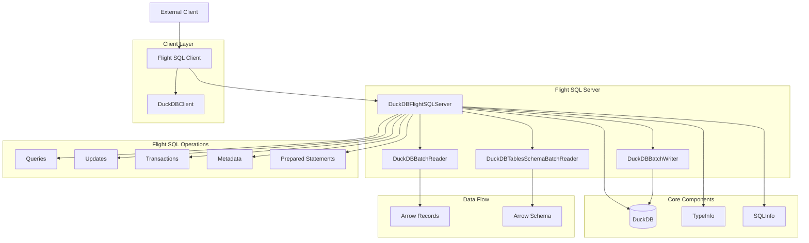

# DuckDB Flight Server

This package implements an Apache Arrow Flight SQL server for DuckDB, enabling high-performance, columnar-based remote database access using the Arrow Flight protocol. The implementation provides efficient data exchange with DuckDB, making it ideal for analytical workloads and distributed query execution.

## 🏗 Architecture



## Features

- Full Flight SQL protocol implementation: Supports Flight SQL operations for queries, updates, and metadata retrieval.
- Transaction management: Provides support for transactional operations using Flight SQL.
- Prepared statements: Enables pre-compiling SQL queries for efficient execution.
- Schema and metadata retrieval: Supports fetching database schema, table information, and column types.
- Type system compatibility: Maps DuckDB types to Apache Arrow types for seamless integration.
- Primary and foreign key support: Retrieves primary and foreign key metadata via Flight SQL.

## Installation

```bash
go get github.com/TFMV/flight
```

## Quick Start

```go
package main

import (
     "context"
      "log"
      "net "
      "github.com/apache/arrow-go/v18/arrow/flight"
      duckdb_flight "github.com/TFMV/flight"
)

func main() {
    server, err := duckdb_flight.NewDuckDBFlightSQLServer()
    if err != nil {
        log.Fatalf("Failed to initialize server: %v", err)
    }

    listener, err := net.Listen("tcp", ":8815")
    if err != nil {
        log.Fatalf("Failed to listen on port: %v", err)
    }
    log.Println("DuckDB Flight SQL server running on port 8815")
    server.Serve(listener)
}
```

## Components

The implementation consists of several key files:

- `duckdb_flight_server.go`: Main server implementation
- `duckdb_batch_reader.go`: Record batch reader for query results
- `duckdb_schema_batch_reader.go`: Schema metadata reader
- `duckdb_type_info.go`: DuckDB type system information
- `duckdb_info.go`: Server information and capabilities

## Type System Mapping

The implementation maps DuckDB types to Arrow types, ensuring compatibility with Arrow-based clients. Supported types include:

| DuckDB Type | Arrow Type |
|-------------|------------|
| TINYINT     | INT8      |
| SMALLINT    | INT16     |
| INTEGER     | INT32     |
| BIGINT      | INT64     |
| FLOAT       | FLOAT32   |
| DOUBLE      | FLOAT64   |
| VARCHAR     | STRING    |
| BLOB        | BINARY    |
| DATE        | DATE32    |
| TIME        | TIME32    |
| TIMESTAMP   | TIMESTAMP |

## License

This project is licensed under the MIT License. See [LICENSE](LICENSE) for details.
