# 🐣 Hatch

*Zero‑copy analytics, delivered at Mach Arrow.*

[](https://goreportcard.com/report/github.com/TFMV/flight)
[](https://github.com/TFMV/flight/actions/workflows/ci.yml)
[](LICENSE)

> **Hatch: DuckDB ↔︎ Arrow Flight.** One binary. No JVM. No friction. Query local Parquet or remote object storage, stream Arrow IPC back in real time, and keep your CPU caches warm while you do it.

---

## ✨ Highlights

| Capability               | Details                                                                |
| ------------------------ | ---------------------------------------------------------------------- |
| **Flight SQL 1.0**       | Full‑spec read/write, prepared statements, transactions                |
| **Turbo Streaming**      | Arrow IPC rows at > **20 M rows/s** on commodity hardware              |
| **Pluggable Middleware** | Auth (JWT/OAuth2), metrics (Prometheus), tracing (OpenTelemetry)       |
| **Modern Go 22**         | Context‑first APIs, generics‑powered type safety, dependency injection |
| **Hot‑reload Config**    | YAML or ENV, zero‑downtime reload via `SIGHUP`                         |
| **Batteries Included**   | Docker image, Helm chart, golden‑path integration tests                |

---

## 🚀 Quick Start

### From Source

```bash
go install github.com/TFMV/flight/cmd/flight@latest
flight serve --config ./config.yaml
```

### Sample Query

```go
client, _ := flightsql.NewClient("localhost:32010")
ctx := context.Background()

// Standard SQL
rdr, _ := client.DoGet(ctx, "SELECT 42 AS answer")
for rdr.Next() { fmt.Println(rdr.Record()) }
```

---

## 🛠️ Configuration

Create a file `config.yaml` (all fields optional):

```yaml
server:
  address: 0.0.0.0:32010
  max_connections: 100
  tls:
    cert_file: certs/server.pem
    key_file:  certs/server-key.pem

database:
  dsn: duckdb://:memory:
  max_open_conns: 32
  health_check_period: 30s

logging:
  level: info   # debug|info|warn|error
  format: json  # json|console

metrics:
  enabled: true
  endpoint: :9090

tracing:
  enabled: false
```

Then:

```bash
flight serve --config ./config.yaml
```

---

## 🧬 Architecture (bird’s‑eye)

```mermaid
%% DuckDB Flight SQL Server – Layered Architecture
flowchart LR
    %% ── LAYER STYLES ──────────────────────────────────────────────
    classDef clientLayer  fill:#e0f7fa,stroke:#0d47a1,stroke-width:1px,color:#0d47a1
    classDef serverLayer  fill:#ede7f6,stroke:#4527a0,stroke-width:1px,color:#4527a0
    classDef serviceLayer fill:#fff3e0,stroke:#ef6c00,stroke-width:1px,color:#ef6c00
    classDef infraLayer   fill:#f1f8e9,stroke:#2e7d32,stroke-width:1px,color:#2e7d32
    classDef dbLayer      fill:#eceff1,stroke:#37474f,stroke-width:1px,color:#37474f
    classDef accent       stroke-dasharray:4 2
    linkStyle default stroke-width:1px,stroke:#546e7a

    %% ── CLIENT LAYER ──────────────────────────────────────────────
    subgraph "Client Layer"
        direction TB
        CLIENT["Flight SQL<br/>Client"]:::clientLayer
    end

    %% ── SERVER LAYER ──────────────────────────────────────────────
    subgraph "Server Layer (gRPC)"
        direction TB
        FS["FlightServer<br/>(gRPC)"]:::serverLayer
        MW["Middleware<br/>Auth / Metrics / Tracing"]:::serverLayer
        FS --> MW
    end

    %% ── API / SERVICE LAYER ───────────────────────────────────────
    subgraph "API / Service Layer"
        direction TB
        HANDLER["FlightSQL Handler"]:::serviceLayer
        QSRV["Query Service"]:::serviceLayer
        MSRV["Metadata Service"]:::serviceLayer
        TSRV["Txn Service"]:::serviceLayer
        HANDLER --> QSRV
        HANDLER --> MSRV
        HANDLER --> TSRV
    end

    %% ── INFRASTRUCTURE LAYER ──────────────────────────────────────
    subgraph "Infrastructure"
        direction TB
        POOL["DuckDB<br/>Connection Pool"]:::infraLayer
    end

    %% ── DATABASE LAYER ────────────────────────────────────────────
    subgraph "Database"
        direction TB
        DUCK["DuckDB<br/>+ Arrow Ext"]:::dbLayer
    end

    %% ── FLOW CONNECTIONS ──────────────────────────────────────────
    CLIENT --> FS
    MW --> HANDLER
    QSRV & MSRV & TSRV --> POOL
    POOL --> DUCK

    %% ── ACCENT HIGHLIGHT ─────────────────────────────────────────
    class HANDLER accent
```



---

## 📚 Usage Patterns

* **Ad‑hoc Analytics:** Point Superset or Tableau at `grpc://host:32010` and run.
* **Streaming Extracts:** Pipe result sets directly into Arrow Flight streams for ML features.
* **Embedded Mode:** Link the library, embed DuckDB, and expose Flight in‑process.

---

## 📄 License

Released under the MIT License. See [LICENSE](LICENSE) for details.
