# 🐣 Hatch

*Zero‑copy analytics, delivered at Mach Arrow.*

[](https://goreportcard.com/report/github.com/TFMV/hatch)
[](LICENSE)
[](https://github.com/TFMV/hatch/actions/workflows/ci.yml)

> Hatch is still in early development, and you're welcome to experiment, explore, or contribute in any way you'd like. You don't need to know Go. Bug reports, documentation improvements, and ideas are all appreciated.

## The Big Idea

A great engine shouldn't be gated by heavyweight infra.
Hatch keeps DuckDB's magic small, open, and composable—so your data can fly wherever you need it.

---

## Why Hatch Exists

### 1. Arrow‑Native Networking Is Inevitable  

Flight SQL moves columnar data faster than REST or JDBC, with schemas baked in. DuckDB already "speaks Arrow" internally—Hatch lets it **broadcast**.

### 2. Self‑Hosted ≠ Heavyweight  

Options today: embed DuckDB yourself, bolt it onto Python/Java web servers, or go proprietary.  
Hatch offers a **third way**: a small server that does one thing: serve SQL over Flight.

### 3. Pipelines Need Lightweight Nodes  

Modern data stacks are Lego bricks: Redis for cache, NATS for events, DuckDB for OLAP. Hatch slots into that ecosystem—just stream Arrow in, stream Arrow out.

### 4. A Playground for Arrow Minds  

Want column‑level ACLs? Write a middleware.  
Need OpenTelemetry spans? Drop in an interceptor.  
Curious about WASM UDFs? Fork and go wild.  
Hatch is scaffolding, not a silo.

---

## 🚀 Quick Start

### From Source

```bash
go install github.com/TFMV/flight/cmd/server@latest
hatch serve --config ./config.yaml
```

### Sample Query

```go
client, _ := flightsql.NewClient("localhost:32010")
ctx := context.Background()

// Standard SQL
rdr, _ := client.DoGet(ctx, "SELECT 42 AS answer")
for rdr.Next() { fmt.Println(rdr.Record()) }
```

---

## 🛠️ Configuration

Create a file `config.yaml` (all fields optional):

```yaml
server:
  address: 0.0.0.0:32010
  max_connections: 100
  tls:
    cert_file: certs/server.pem
    key_file:  certs/server-key.pem

database:
  dsn: duckdb://:memory:
  max_open_conns: 32
  health_check_period: 30s

logging:
  level: info   # debug|info|warn|error
  format: json  # json|console

metrics:
  enabled: true
  endpoint: :9090

tracing:
  enabled: false
```

Then:

```bash
hatch serve --config ./config.yaml
```

---

## 🧬 Architecture (bird's‑eye)

```mermaid
%% DuckDB Flight SQL Server – Layered Architecture
flowchart LR
    %% ── LAYER STYLES ──────────────────────────────────────────────
    classDef clientLayer  fill:#e0f7fa,stroke:#0d47a1,stroke-width:1px,color:#0d47a1
    classDef serverLayer  fill:#ede7f6,stroke:#4527a0,stroke-width:1px,color:#4527a0
    classDef serviceLayer fill:#fff3e0,stroke:#ef6c00,stroke-width:1px,color:#ef6c00
    classDef infraLayer   fill:#f1f8e9,stroke:#2e7d32,stroke-width:1px,color:#2e7d32
    classDef dbLayer      fill:#eceff1,stroke:#37474f,stroke-width:1px,color:#37474f
    classDef accent       stroke-dasharray:4 2
    linkStyle default stroke-width:1px,stroke:#546e7a

    %% ── CLIENT LAYER ──────────────────────────────────────────────
    subgraph "Client Layer"
        direction TB
        CLIENT["Flight SQL<br/>Client"]:::clientLayer
    end

    %% ── SERVER LAYER ──────────────────────────────────────────────
    subgraph "Server Layer (gRPC)"
        direction TB
        FS["FlightServer<br/>(gRPC)"]:::serverLayer
        MW["Middleware<br/>Auth / Metrics / Tracing"]:::serverLayer
        FS --> MW
    end

    %% ── API / SERVICE LAYER ───────────────────────────────────────
    subgraph "API / Service Layer"
        direction TB
        HANDLER["FlightSQL Handler"]:::serviceLayer
        QSRV["Query Service"]:::serviceLayer
        MSRV["Metadata Service"]:::serviceLayer
        TSRV["Txn Service"]:::serviceLayer
        HANDLER --> QSRV
        HANDLER --> MSRV
        HANDLER --> TSRV
    end

    %% ── INFRASTRUCTURE LAYER ──────────────────────────────────────
    subgraph "Infrastructure"
        direction TB
        POOL["DuckDB<br/>Connection Pool"]:::infraLayer
    end

    %% ── DATABASE LAYER ────────────────────────────────────────────
    subgraph "Database"
        direction TB
        DUCK["DuckDB<br/>+ Arrow Extension"]:::dbLayer
    end

    %% ── FLOW CONNECTIONS ──────────────────────────────────────────
    CLIENT --> FS
    MW --> HANDLER
    QSRV & MSRV & TSRV --> POOL
    POOL --> DUCK

    %% ── ACCENT HIGHLIGHT ─────────────────────────────────────────
    class HANDLER accent
```



---

## 📚 Usage Patterns

* **Ad‑hoc Analytics:** Point Superset or Tableau at `grpc://host:32010` and run.
* **Streaming Extracts:** Pipe result sets directly into Arrow Flight streams for ML features.
* **Embedded Mode:** Link the library, embed DuckDB, and expose Flight in‑process.

---

## 📄 License

Released under the MIT License. See [LICENSE](LICENSE) for details.
